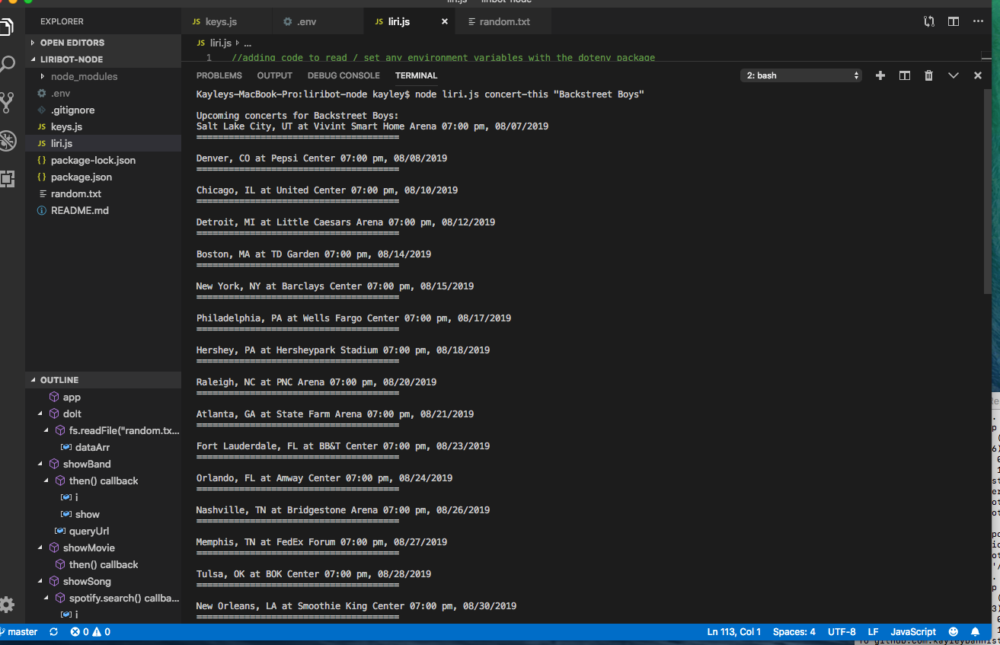
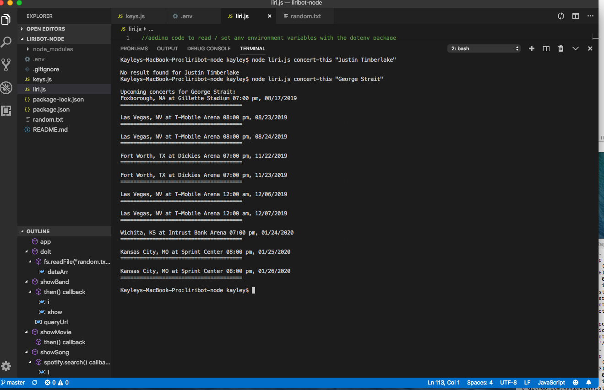
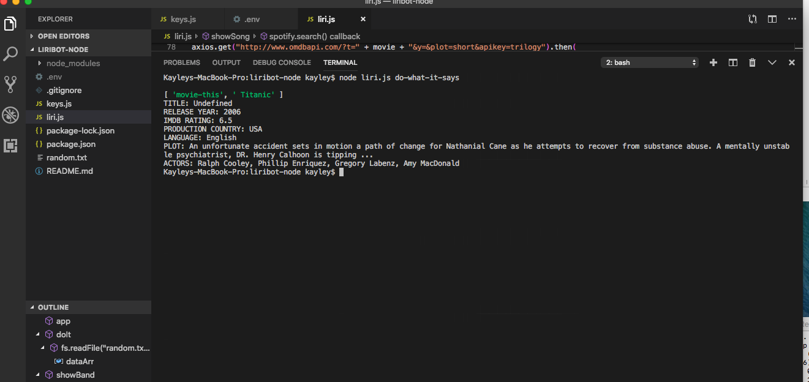
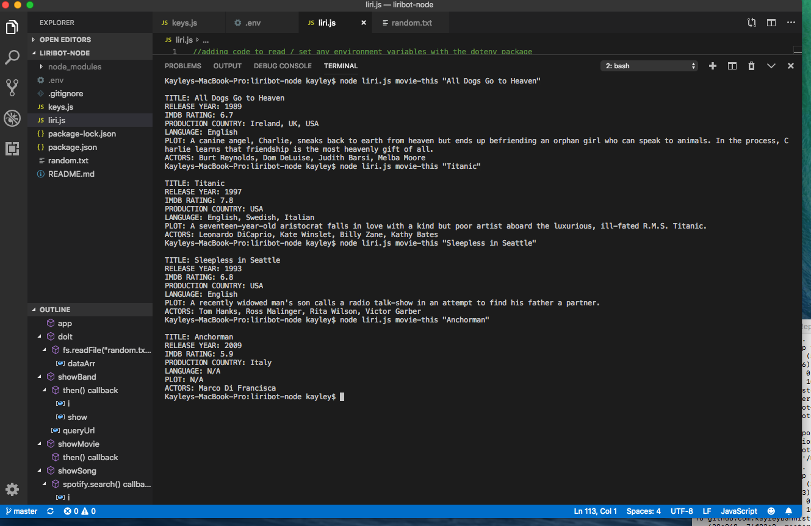
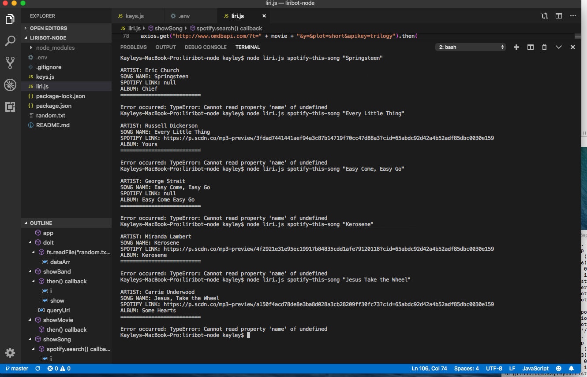

# liribot-node
This is a command line app that uses Node.js and takes users input and then gives info using Spotify, OMBD, and Bands in Town

The application is organized so that the user gives a command and a keyword. If the command matches the parameters given in one of the functions, the function for that specific command will run.

*[GitHub Repo Link](https://github.com/kayleybannister/liribot-node)

concert-this Backstreet Boys

concert-this George Strait

do-what-it-says

movie-this

spotify-this-song

** I tried clicking on these link paths for my images and it keeps asking me to select an application in the app store to open
** all screenshots are saved in the GitHub repository

